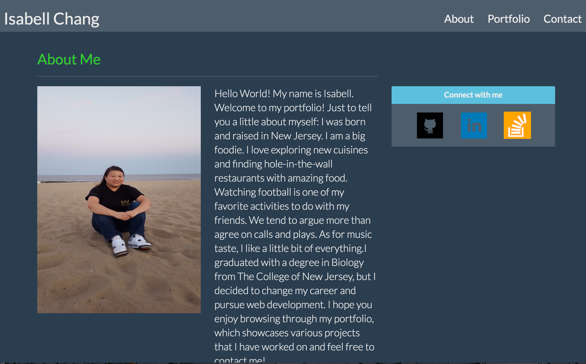
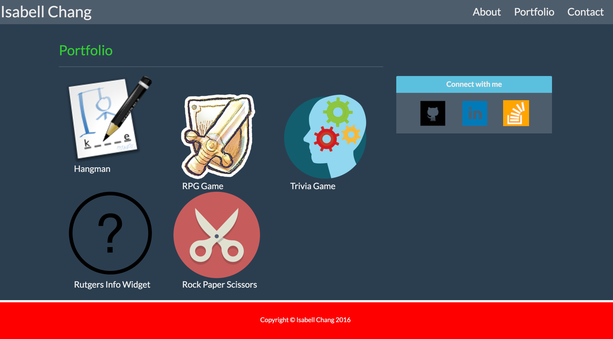
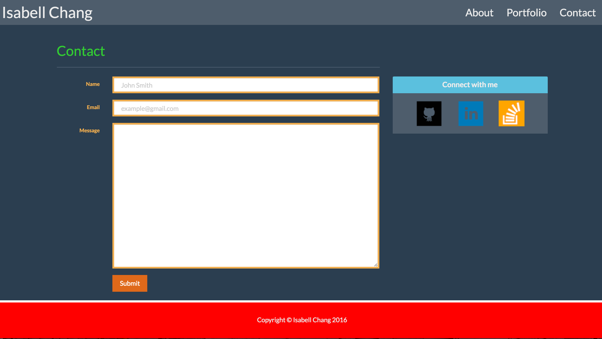

# Portfolio2

[Practice Portfolio with Media Queries](https://shrouded-woodland-31542.herokuapp.com/)

###In this assignment, Bootstrap is used to provide structure to the site. Previously, only HTML and CSS were used. Implementing Bootstrap, allows for an easier way to structure the page and be able to make it more visually appealing to the user. 

###Below are images of each page of the practice portfolio using Bootstrap.

*This is the About page.

*This is the Portfolio page.

*This is the Contact page.
